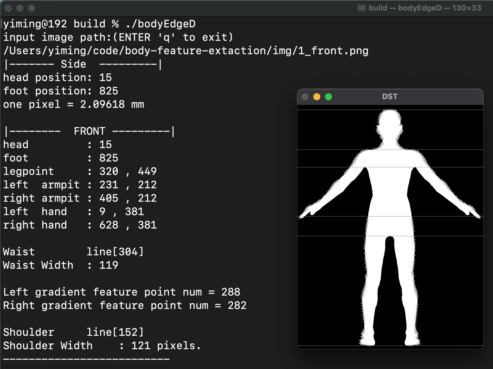

# Body-Feature-Extaction
[](https://www.gnu.org/licenses/gpl-3.0.en.html)  [](https://github.com/estrm/body-feature-extaction/releases/tag/2.0)

Automatic Body Feature Extraction from the Front and Side Images. The Project is about Computer graphics. It can self-collect the key data through a front and side image.

The Project [Body-Feature-Extaction](https://github.com/estrm/Body-Feature-Extaction) is only used in **Eduction**.

## Featuers
* non-contact
* very, very, very easy, just take two photos.

## Usage
1. setup OpenCv Vision library

    ```
    sudo apt-get install opencv (version > 3.0.0)
    ```
2. build
    ```
    mkdir build | cd build
    cmake ..
    make
    ```
3. run
    ```
    ./bodyEdgeD
    ```

    

## Change History
https://github.com/estrm/body-feature-extaction/blob/master/NEWS.md

## Authors
Sun Yiming - [estrm](https://github.com/estrm)
Email: zscandyz[you know]gmail[dot]com

## Licensing
BodyFE is released under Commercial and [GNU GPL v.3](https://www.gnu.org/licenses/gpl-3.0.en.html) open source license.
Commercial Projects: [Contact me for commercial license.] (zscandyz[at]gmail[dot]com)

## Contributions
To submit contributions and send GitHub pull request. You retain the copyright on your contributions.
